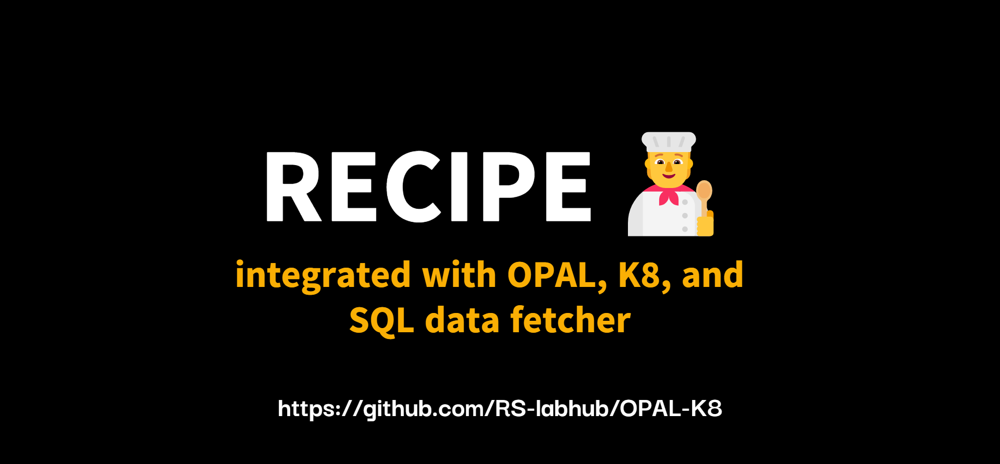
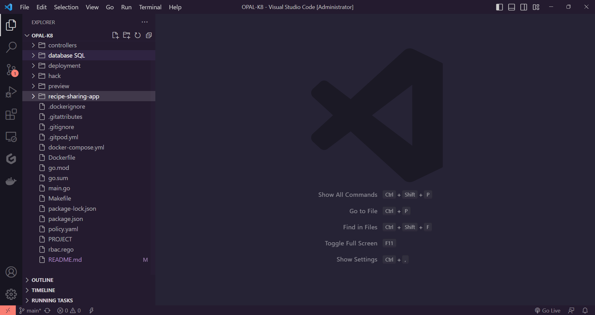
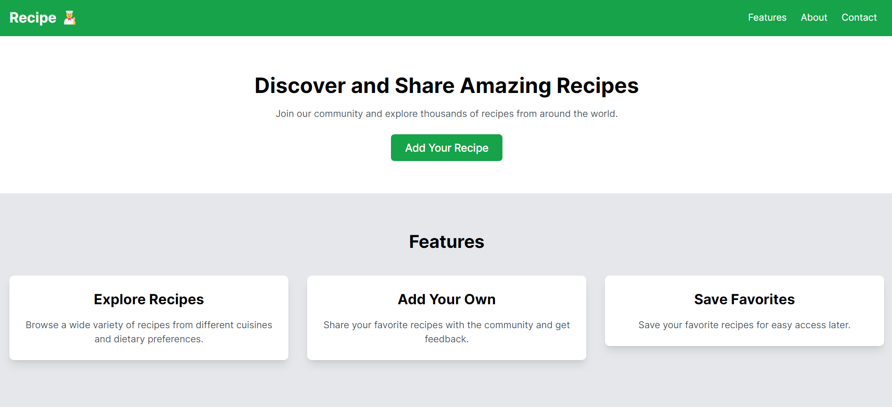
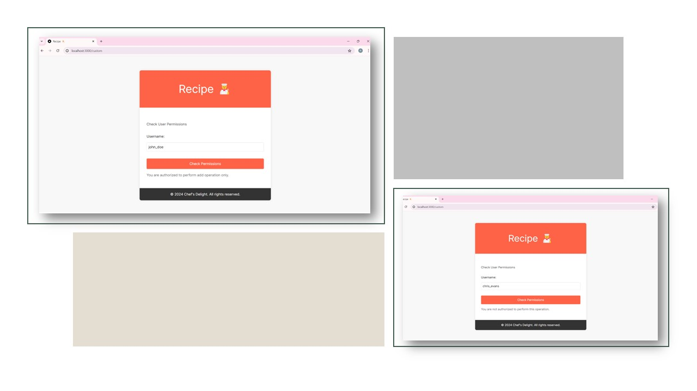

<h1 align="center">
  RECIPE 🧑‍🍳<br>
  <small>where karma decides role</small>
</h1>




<br>

# 🧑‍🍳 Recipe   
 **Recipe Web Application** Built a k8s controller that will allow the deployment of OPAL as part of the k8s platform. Developed a Recipe Webapp where users' karma and location affect their permissions to perform operations. Fetched the data dynamically from a MySQL server.

<br>

## 🪶 Features
- 📖 **User Karma and Location-Based Permissions** :
    - Dynamic Permission Management: Users' permissions to perform various operations within the application are dynamically managed based on their karma and location. This ensures personalized and context-specific access control.
    - Karma System: Users accumulate karma points through their interactions and contributions within the app, which affects their permissions and access levels.
    - Location-Based Access: Users' locations are used to further refine their access permissions, allowing for location-specific content and operations.
- ✒️ **Recipe Sharing Platform** :
    - User-Generated Content: Users can create, share, and browse recipes. This includes the ability to add detailed instructions, ingredients, and multimedia content such as images and videos.
    - Search and Filter Options: The app provides advanced search and filtering options to help users find recipes based on various criteria, including ingredients, cuisine, and user ratings.
- 🚀 **Kubernetes Integration** :
    - OPAL Deployment as a Kubernetes Controller: The application includes a Kubernetes controller to manage the deployment of OPAL as part of the Kubernetes platform, ensuring scalability and reliability.
    - Containerized Services: The app's backend services are containerized using Docker and deployed on Kubernetes, providing a robust and scalable infrastructure.
- 📰 **Database Integration** :
    - MySQL Backend: User data, recipes, and other relevant information are stored in a MySQL database. The app dynamically fetches data from the MySQL server as needed.
    - API Endpoints: The app provides RESTful API endpoints to interact with the MySQL database, enabling operations such as fetching user information and retrieving recipes based on permissions.
- 🔏 **Authentication and Authorization** :
    - User Authentication: Secure user authentication mechanisms are implemented to ensure that only authorized users can access and interact with the application.
    - Role-Based Access Control (RBAC): The application supports role-based access control, where different user roles have varying levels of access and permissions.
- 🖥️ **Monitoring and Logging** :
    - Responsive Design: The application is designed to be fully responsive, ensuring a seamless experience across different devices and screen sizes.
    - User-Friendly Interface: Intuitive navigation and a user-friendly interface enhance the overall user experience, making it easy for users to interact with the app.

- 🕸️ **Next.js Frontend** :
    - React-Based User Interface: The frontend is built using Next.js, providing a fast and responsive user experience.
    - Server-Side Rendering (SSR): Next.js enables server-side rendering, which improves performance and SEO for the web application.
    - Real-Time Updates: The app fetches data dynamically and updates the user interface in real-time as users interact with the application.

<br>

# :books: Index

- [Demo](#movie_camera-Demo)
- [Screenshots](#screenshots)
- [Project Tree](#project-tree)
- [Use Cases](#other-real-world-use-cases-of-opal-open-policy-administration-layer)
- [Set Up](#outbox_tray-Set-up)
- [Contribute](#building_construction-Contribute)
- [Project Author](#people_holding_hands-Meet-the-Author)
- [Contact](#email-contact)

<br>

##  :movie_camera: Demo
- After a brief introduction, let's dive a little more inside the project.
- Here is the walk-through of **Recipe 🧑‍🍳**. If you want to witness a more a hd version, [click here](https://youtu.be/lLmQM-04PTc)

<br>

[](preview/recipe_app.mp4)

<p align="center">Video Demonstration, please 🔈🔉🔊</p>

> In case, the video is not visible, refer this link: https://youtu.be/lLmQM-04PTc

### Screenshots

<p align="center">
  
  <p align="center">working demo</p>
  <br>
  <p align="center">
  
  <p align="center">landing page</p>
  <br>
  <p align="center">
  
  <p align="center">users and live permission</p>
</p>

<br>
<br>

## Project Tree
```bash
OPAL-K8/
├── api/
│   └── v1alpha1/
│       ├── groupversion_info.go
│       ├── opalcontroller_types.go
│       └── zz_generated.deepcopy.go
├── config/
│   ├── certmanager/
│   │   ├── certificate.yaml
│   │   ├── kustomization.yaml
│   │   └── kustomizeconfig.yaml
│   ├── crd/
│   │   ├── bases/
│   │   │   └── rs-labhub.github.io_opalcontrollers.yaml
│   │   ├── kustomization.yaml
│   │   └── patches/
│   │       └── cainjection_in_opalcontrollers.yaml
│   ├── default/
│   │   ├── kustomization.yaml
│   │   └── manager_auth_proxy_patch.yaml
│   ├── manager/
│   │   ├── controller_manager_config.yaml
│   │   ├── kustomization.yaml
│   │   └── manager.yaml
│   ├── prometheus/
│   │   ├── kustomization.yaml
│   │   └── monitor.yaml
│   ├── rbac/
│   │   ├── auth_proxy_client_clusterrole.yaml
│   │   ├── auth_proxy_role.yaml
│   │   ├── auth_proxy_role_binding.yaml
│   │   ├── auth_proxy_service.yaml
│   │   ├── kustomization.yaml
│   │   ├── leader_election_role.yaml
│   │   ├── leader_election_role_binding.yaml
│   │   ├── opalcontroller_editor_role.yaml
│   │   ├── opalcontroller_viewer_role.yaml
│   │   ├── role_binding.yaml
│   │   └── service_account.yaml
│   ├── samples/
│   │   └── rs-labhub_v1alpha1_opalcontroller.yaml
│   └── webhook/
│       ├── kustomization.yaml
│       ├── kustomizeconfig.yaml
│       ├── service.yaml
│       └── webhook.yaml
├── controllers/
│   └── opalcontroller_controller.go
├── database/
│   └── SQL/
│       ├── karma_location.sql
│       ├── karma_location_with_output.sql
│       ├── recipe.sql
│       └── user.sql
├── deployment/
│   ├── mysql-deployment.yaml
│   ├── opal-controller-deployment.yaml
│   ├── opal-service.yaml
│   ├── recipe-deployment.yaml
│   └── recipe-service.yaml
├── hack/
│   └── boilerplate.go.txt
├── recipe-sharing-app/
│   ├── backend/
│   │   ├── Dockerfile
│   │   ├── app.py
│   │   ├── requirements.txt
│   │   └── templates/
│   │       └── index.html
│   └── frontend/
│       ├── Dockerfile
│       ├── package-lock.json
│       ├── package.json
│       └── src/
│           ├── App.js
│           ├── App.test.js
│           ├── index.css
│           ├── index.js
│           ├── logo.svg
│           ├── reportWebVitals.js
│           └── setupTests.js
├── .dockerignore
├── .gitignore
├── .gitpod.yml
├── Dockerfile
├── Makefile
├── PROJECT
├── README.md
├── docker-compose.yml
├── go.mod
├── go.sum
├── main.go
├── package-lock.json
├── package.json
├── policy.yaml
└── rbac.rego
```

<br><br>

## Other Real-World Use Cases of OPAL (Open Policy Administration Layer)
<p align="center">
  Open Policy Administration Layer (OPAL) is a powerful tool for managing dynamic authorization policies in real-time. By integrating OPAL into your application, you can leverage dynamic, context-aware policies that respond to changes in user attributes, environmental conditions, and application state. Below, we explore several real-world use cases of OPAL with detailed examples to demonstrate its versatility and effectiveness.
</p>

### Use Case 1: Dynamic Access Control in Financial Services
A financial services application needs to implement dynamic access control for various user roles, such as customers, financial advisors, and administrators. The access rights need to adapt based on factors like the user's location, the type of account they are accessing, and real-time risk assessments.
#### Example
1. **Customer Access**:
  - Policy: Customers can only access their own financial data.
  - Dynamic Conditions: Access is restricted based on the customer's current location. For example, access may be denied if the customer is accessing their account from a high-risk country.
  - OPAL Implementation:
  ```json
  {
  "subject": "customer",
  "action": "view",
  "resource": "financial_data",
  "conditions": {
    "location": "not_in_high_risk_country",
    "risk_assessment": "low"
    }
  }
  ```

2. **Advisor Access**:
  - Policy: Financial advisors can access customer financial data, but only during business hours and if the customer has granted explicit permission.
  - Dynamic Conditions: Access is restricted based on the advisor's location and current time.
  - OPAL Implementation:
  ```json
  {
  "subject": "advisor",
  "action": "view",
  "resource": "customer_financial_data",
  "conditions": {
    "location": "in_office",
    "time": "within_business_hours",
    "customer_permission": "granted"
    }
  }
  ```

3. **Administrator Access**:
  - Policy: Administrators have full access to all financial data but must undergo multi-factor authentication (MFA) if accessing from outside the office network.
  - Dynamic Conditions: MFA requirement is triggered based on the administrator's access location.
  - OPAL Implementation:
  ```json
  {
  "subject": "administrator",
  "action": "manage",
  "resource": "all_financial_data",
  "conditions": {
    "location": "outside_office_network",
    "mfa_status": "completed"
    }
  }
  ```

### Use Case 2: Context-Aware Permissions in Healthcare Applications
A healthcare application needs to enforce strict access control to patient records, ensuring that only authorized personnel can access sensitive information based on their role, the time of access, and the specific patient's condition.
#### Example

1. **Doctor Access**:
  - Policy: Doctors can access the records of patients they are treating.
  - Dynamic Conditions: Access is limited to active treatment periods and emergency situations.
  - OPAL Implementation:
  ```json
  {
  "subject": "doctor",
  "action": "view",
  "resource": "patient_records",
  "conditions": {
    "treatment_status": "active",
    "emergency_status": "true"
    }
  }
  ```

2. **Nurse Access**:
  - Policy: Nurses can access patient records for the ward they are assigned to, but only during their shift.
  - Dynamic Conditions: Access is restricted based on shift times and assigned ward.
  - OPAL Implementation:
  ```json
  {
  "subject": "nurse",
  "action": "view",
  "resource": "ward_patient_records",
  "conditions": {
    "shift_status": "active",
    "assigned_ward": "true"
    }
  }
  ```

3. **Researcher Access**:
  - Policy: Researchers can access anonymized patient data for approved studies.
  - Dynamic Conditions: Access is restricted to anonymized data sets and only for the duration of the study.
  - OPAL Implementation:
  ```json
  {
  "subject": "researcher",
  "action": "view",
  "resource": "anonymized_patient_data",
  "conditions": {
    "study_status": "approved",
    "study_duration": "active"
    }
  }
  ```
### Use Case 3: Fine-Grained Access Control in E-commerce Platforms
An e-commerce platform needs to manage access to different functionalities for various user roles, such as customers, sellers, and administrators, with dynamic adjustments based on user behavior, purchase history, and account status.
#### Example
1. **Customer Access**:
  - Policy: Customers can view and purchase products, but their spending limit is dynamically adjusted based on their purchase history and account status.
  - Dynamic Conditions: Spending limit and product access are influenced by customer behavior and account health.
  - OPAL Implementation:
  ```json
  {
  "subject": "customer",
  "action": "purchase",
  "resource": "products",
  "conditions": {
    "spending_limit": "not_exceeded",
    "account_status": "active"
    }
  }
  ```

2. **Seller Access**:
  - Policy: Sellers can manage their product listings and view sales data.
  - Dynamic Conditions: Access to sales data is restricted to their own products and influenced by seller performance metrics.
  - OPAL Implementation:
  ```json
  {
  "subject": "seller",
  "action": "manage",
  "resource": "product_listings",
  "conditions": {
    "seller_performance": "satisfactory"
    }
  }
  ```

3. **Administrator Access**:
  - Policy: Administrators have full control over the platform but must follow enhanced security protocols for high-privilege actions.
  - Dynamic Conditions: High-privilege actions require additional verification steps based on the administrator's recent activity and system health.
  - OPAL Implementation:
  ```json
  {
  "subject": "administrator",
  "action": "control",
  "resource": "platform",
  "conditions": {
    "verification_status": "completed",
    "recent_activity": "safe"
    }
  }
  ```

### Conclusion
These examples illustrate the flexibility and power of OPAL in implementing dynamic, context-aware access control across various industries. By leveraging OPAL, organizations can ensure that their applications are secure, compliant, and adaptable to changing conditions. Whether it's financial services, healthcare, or e-commerce, OPAL provides a robust framework for managing fine-grained permissions in real-time.

For more detailed information on how to integrate OPAL into your application, visit the [Official OPAL documentation](https://github.com/authorizon/opal).


<br>


## Dependecies
1. **Next.js**
2. *React*
3. **Axios**
4. *Node.js*
5. **Express**
6. *MySQL*
7. **OPAL**
8. *Kubectl*
4. *Helm*
5. **Docker**

#

##  :outbox_tray: Installation Guide
These are the steps required to install and run the Recipe 🧑‍🍳 project:


1. Clone the Repository: Open a terminal or command prompt and clone the Recipe 🧑‍🍳 repository from GitHub using the following command:

  ```bash
    git clone https://github.com/RS-labhub/OPAL-K8.git
  ```

2. Navigate to the Repository Directory: Change your current directory to the cloned Recipe 🧑‍🍳 repository:

  ```bash
    cd OPAL-K8
  ```
3. Kubernetes Controller to Deploy OPAL
    - Prerequisites
        - A running Kubernetes cluster (local or cloud-based).
        - Docker installed on your local machine.
        - kubectl configured to interact with your Kubernetes cluster.
        - Go programming language installed.

    - Step 1: Set Up a Kubernetes Cluster
        - You can use Minikube for local development or a cloud provider like GKE, EKS, or AKS for a production-ready cluster.

    - Step 2: Create the Kubernetes Controller
        - Define the Custom Resource Definitions (CRDs)
        - Create the Controller Code
    - Step 3: Build and Deploy the Controller
        1. Build the Controller Image
        ```docker
        docker build -t mycompany/opal-controller:latest .
        ``` 
        2. Push the Image to a Registry
        ```docker
        docker push mycompany/opal-controller:latest
        ```
        3. Deploy the Controller to the Cluster
        4. Apply the deployment
        ```kubectl
        kubectl apply -f opal_crd.yaml
        kubectl apply -f controller_deployment.yaml
        ```
4. Web Application with Dynamic Permissions
    - Prerequisites
        - Node.js and npm installed.
        - MySQL server running and configured.
    - Step 1: Set Up a Next.js Project
        1. Install Required Dependencies
        ```
        npm install axios mysql2
        ```
        2. Run the project
        ```sh
        npm run dev
        ```
<br>

> Note: The running port should look like this:
Open `http://localhost:3000` in your web browser to see the list of users and recipes filtered by karma and location.

<br>
<br>


## What to do after installation?
Once Recipe 🧑‍🍳 is installed and running, by following these guidelines, you will set up and install a Kubernetes controller to deploy OPAL and develop a web application where users' permissions are dynamically influenced by their karma and location, with data fetched from a MySQL server.


$~$

## Setup and Contributing Guidelines
    
**Set Up Your Environment**

1. `Fork` our repository to your GitHub account. 
2. `Clone` your fork to your local machine. 
    Use the command `git clone https://github.com/RS-labhub/OPAL-K8.git`.
3. Create a new branch for your work. 
    Use a descriptive name, like `fix-login-bug` or `add-user-profile-page`.
    
**Commit Your Changes**

- Commit your changes with a _clear commit message_. 
  e.g `git commit -m "Fix login bug by updating auth logic"`.

**Submit a Pull Request**

- Push your branch and changes to your fork on GitHub.
- Create a pull request, compare branches and submit.
- Provide a detailed description of what changes you've made and why. 
  Link the pull request to the issue it resolves. 🔗
    
**Review and Merge**

- I will review your pull request and provide feedback or request changes if necessary. 
- Once your pull request is approved, we will merge it into the main codebase 🥳

$~$

## :people_holding_hands: Meet the Author


### :email: Contact 
- Email: rs4101976@gmail.com
- Head over to my github handle from [here](https://github.com/RS-labhub)

<br>

<p align="center">
<a href="https://twitter.com/rrs00179" target="blank"></a>
<a href="https://www.linkedin.com/in/rohan-sharma-9386rs/" target="blank"></a>
</p>

<br>

<p align="center">
   Thank you for visting this Repo <br>If you like it, <a href="https://github.com/RS-labhub/I-Love-You/stargazers">star</a> ⭐ it
</p>
